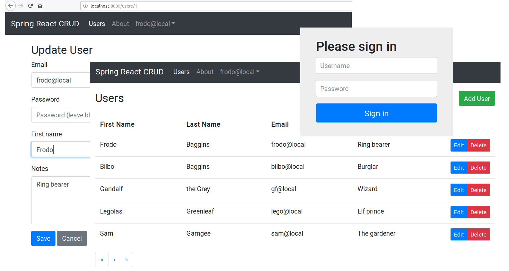

React.js and Spring Data REST - CRUD
====================================

CRUD application with security enabled: a PoC with
ReactJS in the frontend and Spring Data REST in the backend.

## 🚀 Stack

- **Backend**: Java 17 LTS, Spring Boot 3 (web, security, JPA),
  Postgres / H2 (or whatever DB is compatible with JPA).
- **Frontend**: ReactJS, React Router, Bootstrap,
  Axios, Reactstrap, Node 18 / Npm / Webpack (build).

### ⚙️ Requirements

- **JDK 17+**
- **Maven 3+**, or you can use the script `./mvnw` instead that it will install
  Maven 3.9 in the user space automatically if the required version isn't there

To build the web assets the project uses **Node.js**, **Webpack**, ...
but all of them are installed and triggered by Maven automatically
in the user space.

## 🎮 Usage

Launch the application with:

    $ mvn spring-boot:run

Or use `./mvnw` instead of `mvn` (`mvnw.cmd` for Window platforms).

Then access the application with http://localhost:8080/, or access
to the API with http://localhost:8080/api/.

One of the users to access the app with privileged permissions is `frodo@local`,
and the password `admin`. Check and edit the initial dataset in
the [DatabaseLoader.java](src/main/java/ar/com/mrdev/app/user/DatabaseLoader.java#L46-L50)
file.

If you access the API through the HAL browser, it will require to sign-in
like with the dash panel using a web page provided by Spring Security,
but if you are going to consume the API with a 3rd party tool
you will need to authenticate using
[HTTP Basic Authentication](https://en.wikipedia.org/wiki/Basic_access_authentication),
eg. with `curl` the `Authorization: Basic ...` header can be generated using
the `-u user:pass` argument:

    $ curl -u gf@local:admin http://localhost:8080/api/users

#### 🌶 Hot reloading

To edit Javascript or CSS resources and see the changes in the
browser without the need to re-launch the application, execute within
a command line:

    $ npm run watch

And leave it running (if it doesn't work, try with `target/node/npm run watch`).

#### 📦 Packaging

Pack the application in a single .jar with all the dependencies
and the web server with:

    $ mvn package

Add the argument `-Dmaven.test.skip` if you don't want to run the tests before packaging.

Then you can run the .jar with:

    $ java -jar target/app-0.0.1-SNAPSHOT.jar

### ⏯ Tests

For now only a test that checks that the spring context
can be loaded is in the source code. Execute with:

    $ mvn test

A _GitHub Action_ workflow is configured as well
as **CI** environment, check out [maven.yml](.github/workflows/maven.yml).

Versions
--------

For now there are two versions, each one with its own branch:

- `master`: main version with an in-memory database (H2) to quickly
  launch the application without the need of a database installed (local tests).
- `postgres`: modified version with PostgreSQL configured,
  ready for "production" usage.

About
-----

**Source code**: https://github.com/mrsarm/spring-react-crud

**Authors**:
* Mariano Ruiz <mrsarm (at) gmail>

The goal was to learn React and using Spring as backend, so I started
following this [guide](https://spring.io/guides/tutorials/react-and-spring-data-rest)
from _Spring.io_ (Greg Turnquist and other authors from _Pivotal_), but I ended up
rewriting  almost all from scratch and adding a lot of features, like Bootstrap,
client side validations, routing, updating dependencies to major versions ...

2015-2023  |  Apache-2.0

Ana's notes
-----

to build image

	$ docker build -t project-app-image .

to run container

	$ docker run -p 8080:8080 project-app-image 

